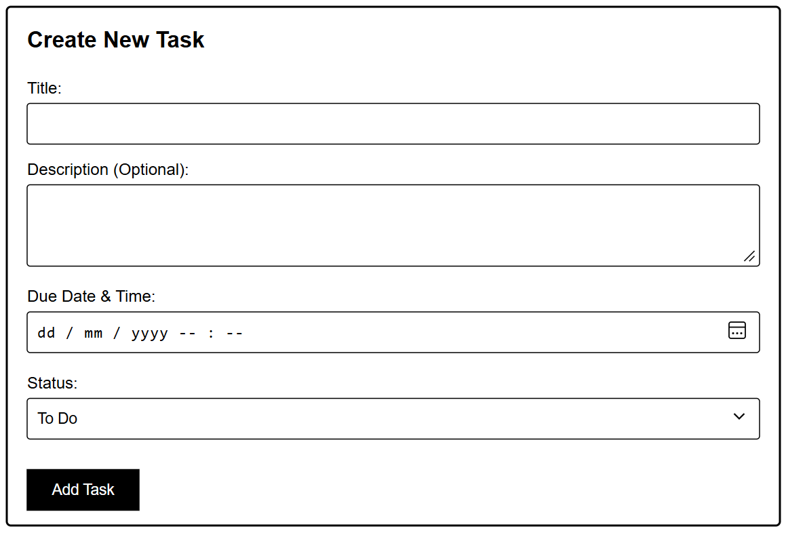

# HMCTS Task Manager

This project is a submission for the DTS Developer Technical Test. It provides a simple, user-friendly system for HMCTS caseworkers to efficiently track and manage their tasks.

##  Technology Stack & Architecture

To meet the technical requirements of building a full-stack application with a database, validation, and documentation, I chose the following stack:

* **Backend:** **Python & FastAPI**. FastAPI was selected because it is modern, incredibly fast, and handles data validation natively (via Pydantic). Most importantly, it automatically generates interactive API documentation out of the box.
* **Database:** **SQLite & SQLAlchemy (ORM)**. SQLite provides a lightweight, file-based database that requires no external server setup, making it perfect for a local technical test. SQLAlchemy handles the database interactions cleanly.
* **Frontend:** **Vanilla JavaScript, HTML, and CSS**. I opted for a dependency-free frontend to keep the project lightweight and incredibly easy for reviewers to run. It interacts asynchronously with the backend via the native `fetch` API.
* **Testing:** **Pytest**. Used to implement unit tests for the backend API endpoints.

##  Features

* **Task Management:** Create, view, update (status), and delete tasks.
* **Search & Retrieval:** Retrieve a specific task by its automatically generated ID, or view all tasks at once.
* **Live Dashboard:** A real-time summary at the top of the UI showing counts of tasks in "To Do", "In Progress", and "Done" statuses.
* **Validation & Error Handling:** The backend ensures that required fields (Title, Due Date) are present and correct, returning appropriate HTTP status codes (e.g., 404 for missing tasks).

---

##  How to Run the Application

### 1. Set up the Backend
Ensure you have Python 3 installed. Open your terminal in the backend directory and run:

```bash
# Install the required dependencies
pip install -r requirements.txt

# Start the FastAPI server (using -m to avoid Windows PATH issues)
python -m uvicorn main:app --reload
```

The backend will now be running at http://127.0.0.1:8000.

### 2. View API Documentation
With the server running, navigate to http://127.0.0.1:8000/docs in your web browser. Here you will find the auto-generated Swagger UI detailing all API endpoints, schemas, and error responses. You can even test the API directly from this page.

### 3. Launch the Frontend
Because the frontend is built with Vanilla JavaScript, there is no build process required.
Simply open the index.html file in any modern web browser. The UI will automatically connect to the local Python backend.

### Running Unit Tests
Unit tests have been implemented using Pytest. To run the test suite, ensure your virtual environment is active (if using one) and execute:

Bash
python -m pytest test_main.py
This will test the core API functionality, including task creation and retrieval, directly against the test client.
